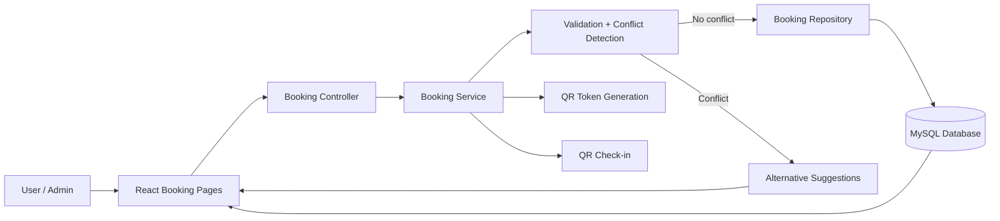

# Mathuran - Booking Management

## 1. Contribution Overview

My contribution covers the Booking Management module for the Smart Campus Operations Hub. I implemented the full booking workflow, conflict prevention, calendar support, and QR-based check-in features using Spring Boot, React, and MySQL.

This module was designed to satisfy the assignment's minimum requirements first, then extend the system with innovation features.

## 2. Requirements Covered

### 2.1 Minimum Requirements

- Create booking request
- View own bookings
- Update booking if allowed
- Cancel booking
- Admin approve/reject booking
- Prevent overlapping bookings

### 2.2 Innovation Features

- Smart conflict detection with alternative suggestions
- Booking calendar view
- QR-based check-in for approved bookings
- Recurring booking option

## 3. Backend Design and Implementation

### 3.1 Stack

- Spring Boot REST API
- Java 21
- MySQL database
- Validation and global exception handling

### 3.2 Domain Model

The booking entity stores:

- requester name, email, and IT number
- resource type and resource name
- purpose
- booking date, start time, and end time
- booking status
- admin note
- QR token and check-in details
- recurring group information

### 3.3 Booking Workflow

The booking lifecycle follows this status flow:

- `PENDING` -> `APPROVED`
- `PENDING` -> `REJECTED`
- `PENDING` / `APPROVED` -> `CANCELLED`
- `APPROVED` -> `CHECK-IN` using QR token validation

### 3.4 Conflict Prevention

I implemented overlap checking for the same resource on the same date.

The conflict rule is:

- a conflict exists when `existingStart < requestedEnd` and `existingEnd > requestedStart`

This allows back-to-back bookings but blocks overlapping time ranges.

### 3.5 Smart Suggestions

When a conflict occurs, the backend returns alternative available time slots. This improves the booking experience by helping the user recover from a conflict without manually searching for a new slot.

### 3.6 Recurring Booking

The booking form supports a recurrence count. When the count is greater than one, the backend creates weekly bookings using the same time range and resource, grouped under one recurrence identifier.

### 3.7 QR Check-in

When an admin approves a booking, the backend generates a QR token. The approved booking can later be checked in using that token. This feature supports attendance verification and controlled resource access.

On the frontend, the approved booking also displays a scannable QR code so the check-in flow is visible and easy to demonstrate during viva.

## 4. Backend Endpoints

The booking module includes these endpoints:

- `POST /api/bookings` - create booking request
- `GET /api/bookings/my` - view own bookings
- `GET /api/bookings` - admin/all bookings with filters
- `GET /api/bookings/{id}` - view booking details
- `PUT /api/bookings/{id}` - update booking if allowed
- `PATCH /api/bookings/{id}/approve` - approve booking
- `PATCH /api/bookings/{id}/reject` - reject booking
- `PATCH /api/bookings/{id}/cancel` - cancel booking
- `GET /api/bookings/calendar` - calendar view data
- `PATCH /api/bookings/{id}/check-in` - QR check-in

## 5. Frontend Design and Implementation

### 5.1 Stack

- React
- React Router
- Vite
- VS Code

### 5.2 Pages Implemented

- Booking form page
- My bookings page
- Booking approval page for admin
- Calendar/schedule page

### 5.3 UI Flow

- Users create booking requests from the booking form page.
- Users view, update, or cancel their own bookings from the My Bookings page.
- Admin users approve or reject pending requests from the Booking Approval page.
- The Calendar page groups bookings by date and supports QR check-in for approved bookings.
- Approved bookings show a scannable QR code in the UI for quick verification.

## 6. Database and Persistence

The booking module persists data in MySQL, which satisfies the assignment requirement for real database usage rather than in-memory storage.

## 7. Testing and Quality

I validated the module through build checks and compile verification.

- Backend compile: successful
- Frontend production build: successful

The booking code also includes validation, structured error responses, and conflict handling to support reliable runtime behavior.

## 8. GitHub and CI

The repository includes a GitHub Actions workflow so backend and frontend builds can be checked automatically early in development.

This supports active version control and makes the project easier to review and demonstrate.

## 9. Viva Preparation Notes

For the viva, I should be able to explain:

- how booking conflicts are detected
- how approval and rejection work
- how booking statuses change across the workflow
- how QR check-in improves verification
- how smart alternative suggestions improve the booking experience

## 10. Summary Statement

I implemented the Booking Management module as a complete end-to-end workflow using Spring Boot, React, and MySQL. The solution covers the assignment's minimum requirements and adds innovation features such as conflict suggestions, calendar view, QR check-in, and recurring bookings.

## 11. Booking Module Architecture

### 11.1 Architecture Overview

The booking module follows a layered client-server architecture:

- The React client collects booking data and displays booking status, calendar views, and approval actions.
- The Spring Boot REST API validates requests, applies booking rules, and exposes booking endpoints.
- The service layer handles booking workflow, conflict detection, recurrence creation, QR token generation, and check-in logic.
- The repository layer persists booking data in MySQL.
- Global exception handling returns structured validation and conflict errors.

### 11.2 Booking Flow Diagram

### 11.3 Request Flow

1. A user submits a booking request from the React booking form.
2. The controller receives the request and forwards it to the service layer.
3. The service validates the time range, checks for overlaps, and prepares suggestions if needed.
4. The repository writes the booking to MySQL when the slot is valid.
5. Admin approval or rejection updates the booking status.
6. Approved bookings can later be checked in using the generated QR token.

### 11.4 Why This Design Works Well

- It is easy to explain in viva because each responsibility is isolated.
- It supports the assignment's minimum workflow clearly.
- It leaves room for innovation without changing the basic architecture.
- It makes testing easier because validation, workflow, and persistence are separated.
